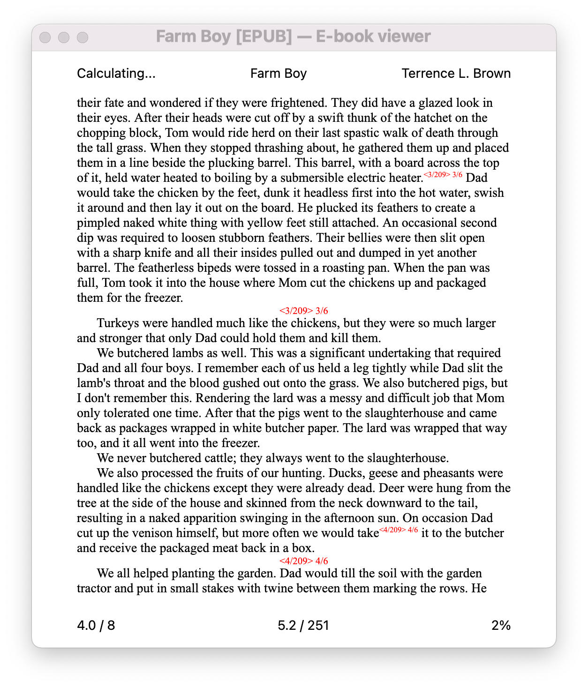
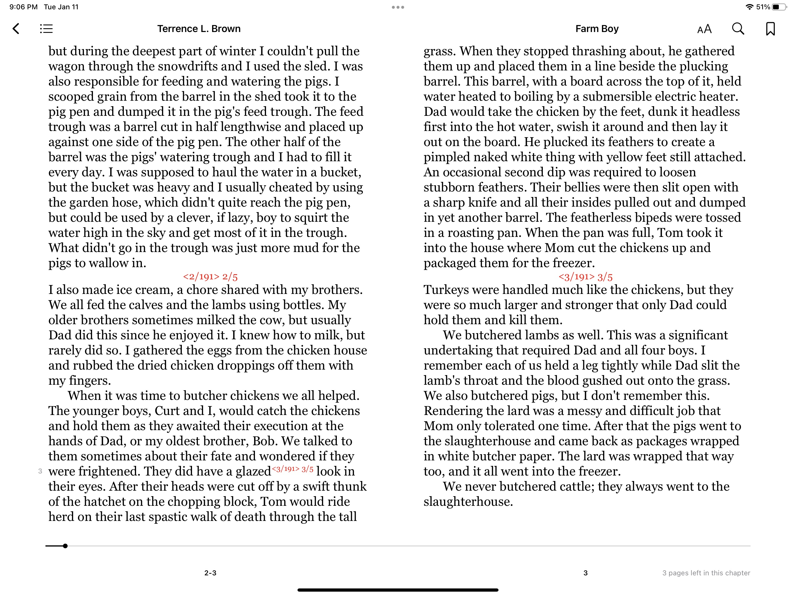

# epubpaginator

epubpaginator is a Python script that generates pagination for ePub
books. 

## Features

* For ePub3 files, epubpaginator can generate a page-list table in the
  navigation document, and corresponding page links in the epub text.
* epubpaginator can generate "pagelines"--information lines in the text
  of an ePub2 or ePub3 document. These are placed at the end of the
  paragraph where the page break occurs and appear as separate
  paragraphs in the book.
* epubpaginator can generate page information notes formatted as
  superscripts in the text of an ePub2 or ePub3 document. These
  superscripts are placed after the word where the page break occurs.
* If an ePub3 document has existing pagination, epubpaginator can match
  the pagelines or superscripts to the existing pagination. This allows
  you to see the publisher's page numbering in epub readers that do not
  support epub3 page-list tables.
* Font size, color and alignment (right, left, or center) are selectable
  for pagelines.
* Font size and color are selectable for superscripts.
* Pagelines and superscripts may optionally show total page counts for the book
  and the current chapter.
* For ebooks without existing pagination, the page size may be defined
  by specifying words per page, or by specifying total pages for the
  book in which case words per page is calculated by dividing the book
  word count by the total pages specified.

## Requirements

1. Python 3.7 or greater. 
2. Optional [epubcheck module](https://pypi.org/project/epubcheck/)--see below

## Installation

1. Download epubpaginator.zip and unzip to your chosen location.

## Usage

epubpaginator is a command-line tool that can be configured with
command line options, or by referencing a configuration file. The
configuration file is in json format. 

Download the zip file from [Github](https://github.com/tthkbw/epub_pager) and
unzip into a directory of your choice. From that directory, run:

`python epubpaginator.py --help`

to see the help message:

```
./epubpaginator.py --help
usage: epubpaginator.py [-h] [-c CFG] [--outdir OUTDIR] [--match]
                        [--genplist] [--pgwords PGWORDS] [--pages PAGES]
                        [--pageline] [--pl_align {right,left,center}]
                        [--pl_color {red,blue,green,none}]
                        [--pl_bkt {<,(,none}] [--pl_fntsz PL_FNTSZ]
                        [--pl_pgtot] [--superscript]
                        [--super_color {red,blue,green,none}]
                        [--super_fntsz SUPER_FNTSZ] [--super_total]
                        [--chap_pgtot] [--chap_bkt {<,(,none}]
                        [--epubcheck EPUBCHECK] [--chk_paged] [--chk_orig]
                        [--ebookconvert EBOOKCONVERT] [--DEBUG]
                        ePub_file

Paginate ePub file.

positional arguments:
  ePub_file             The ePub file to be paginated.

optional arguments:
  -h, --help            show this help message and exit
  -c CFG, --cfg CFG     configuration file
  --outdir OUTDIR       location for output ePub files
  --match               If pagination exists, match it.
  --genplist            If no pagination generate the navigation page list
                        and page links
  --pgwords PGWORDS     define words per page; if 0, use pages
  --pages PAGES         if = 0 use pgwords; else pgwords=(wordcount/pages)
  --pageline            generate and insert page pagelinesinto the ePub text
  --pl_align {right,left,center}
                        'right', 'left' or 'center'; specify alignment of the
                        pageline
  --pl_color {red,blue,green,none}
                        html color for the inserted pageline
  --pl_bkt {<,(,none}   character to use to bracket page number
  --pl_fntsz PL_FNTSZ   font size as percentage of book font for the pageline
  --pl_pgtot            include total pages in the pageline
  --superscript         generate superscripted page numbers
  --super_color {red,blue,green,none}
                        html color for the inserted page pagelinee.g. 'red'
  --super_fntsz SUPER_FNTSZ
                        font size as percentage of book font for the pageline
  --super_total         include total pages in the pageline
  --chap_pgtot          include chapter page and total in the pagelineand/or
                        superscript
  --chap_bkt {<,(,none}
                        '<', '(' or nothing; character to use to bracket page
                        number
  --epubcheck EPUBCHECK
                        location of epubcheck external executable
  --chk_paged           Run epubcheck on paged epub file
  --chk_orig            Run epubcheck on file being paginated
  --ebookconvert EBOOKCONVERT
                        location of ebook conversion executable
  --DEBUG               print additional debug information to the log file
```

An example configuration file "epub_pager.cfg" is provided: 

``` json
{
    "outdir": "/Your/path/for/epubs",
    "match": true,
    "genplist": true,
    "pgwords": 300,
    "pages": 0,
    "pageline": true,
    "pl_align": "center",
    "pl_color": "red",
    "pl_bkt": "<",
    "pl_fntsz": "75%",
    "pl_pgtot": true,
    "superscript": false,
    "super_color": "red",
    "super_fntsz": "60%",
    "super_total": false,
    "chap_pgtot": true,
    "chap_bkt": "",
    "ebookconvert": "none",
    "epubcheck": "none",
    "chk_orig": true,
    "chk_warn": false,
    "DEBUG": false
}
```

The configuration file is in json and must use json syntax,
not python syntax.

## Why Paginate?

Most epub readers display page numbers that are based on what fits on the
display of your device given its size and the font size you have chosen. When
you switch devices (say, from your iPhone to your iPad) or change the font
size, the page size and total number of pages in your book changes. This means
you can't use page numbers as bookmarks. It also means you don't have
consistent page lengths, so you don't have a feel for how much is left in a
chapter or in the book. Percentages don't help much. 20% of a book with 75,000
words is quite different from 20% of a book with 200,000 words.

Consistent paging can be useful to mitigate these issues. If an epub book
contains paging information that matches the paging of a physical book, the
ability to see the paging information in an ereader that does not support using
epub3 paging can also be useful.

epubpaginator provides all of these features.

## Epub Reader Support

Most epub readers simply ignore epub3 page-lists. Some read the
page-lists and provide the ability to go to a particular page, but
little else. 

Apple Books on iOS uses epub3 pagination as an option. You must select
"Tap to show print edition page numbers" at the bottom of the Table of
Contents for epub3 pagination to be used. If the ebook does not contain
a page-list element in the navigation file, this option will not be
displayed. When print edition page numbering is enabled, the page
numbering in the Books footer reflects the page as specified in the
page-list. In addition, Books will display the page number in the margin
beside the location where the actual page break occurred (this could be
in the middle of a paragraph). 

Since most epub readers do not support displaying epub3 page-list
information, epubpaginator provides two alternatives for custom
pagination of epub files, pagination that will be shown by all
ereaders.

### Pagelines

The 'pagelines' option directs epubpaginator to place formatted lines
containing pagination information in the text. These pagelines are
placed at the end of the paragraph in which the page break occurred.
Pagelines contain the current page number of the book and optionally the
total pages in the book. Chapter page and chapter totals can also be
added.

### Superscripts

The 'superscript' option directs epubpaginator to place page information
in the text of the book as a superscript placed after the word where the
page break occurs. Superscripts contain the current page number of the book
and optionally the total pages in the book. Chapter page and chapter
totals can also be added.

## Examples

The following image is the Calibre ebook-viewer app's display of a page
in a book paginated with epubpaginator. The first superscript page
information is in the sixth line of the page. The superscript is placed
just after the word at which the page break occurred. The pageline is
placed at the end of the paragraph in which the page break occurred. In
each case, both current page and page totals for the book and the
chapter are presented. 

The superscripts are colored red and their fontsize is 60% of
the book's fontsize. 

The pagelines are colored red, centered, and with a fontsize 75% of the
book's fontsize.

Note that Calibre ebook-viewer does not display information from the
page-list of this ebook in its footer. The footer page numbering is
generated by Calibre ebook-viewer and is in about 200 words per page.



By contrast, Apple Books shows the page-list page numbers in its footer
line (where a page that contains a page break will show, as in this
example, 2-3), and also shows the line location of the page break by showing
the page number in the margin. 

One can now see that the superscript inserted by epubpaginator appears
in the same line as the page break, and the pageline inserted by
epubpaginator appears at the end of the paragraph in which the page
break occurred. 



## The Details

### Color Formatting

epubpaginator allows setting the color of the pageline and the
superscript. However, depending on the ereader used, and the theme used
in the ereader, the colors may be ignored by the ereader.

In Apple Books, for example, colors are acknowledged when the background
selected is white or sepia, but ignored when the background is gray or
black.

### File Handling

epubpaginator creates a copy of the input epub file and operates on
the copy. Although epubpaginator should not corrupt, delete, or
otherwise modify the original epub file, always back up your files!
epubpaginator requires epub files without DRM (Digital Rights
Management) to operate. It outputs the modified file to the directory
specified in 'outdir' with '_paged' appended to the file name.

### Determining the Page Length

If epubpaginator detects an existing page-list element in the
navigation file of the epub (this can only occur when the epub file is
version 3), 'genplist' is forced to false. epubpaginator does not
overwrite or modify an existing page-list and will not generate a second
page-list if one exists.

If 'match' is set and a page-list element is found, then pagination for
pagelines and/or superscripts is matched to the existing pagination.

If 'genplist' or 'pagelines' or 'super' are enabled and no existing
page-list element is found, the pagination will be based on the values
of the options 'pgwords' and 'pages' as follows:

1. If 'pgwords' and 'pages' are zero, this is a fatal error.
   epubpaginator has no way to determine where to place pages.
2. If 'pgwords' is not zero, its value is used to determine the page
   length for the paginated book.
3. if 'pgwords' is zero and 'pages' is not zero, then 'pgwords' is set
   to the integer value of the book's word count divided by the value of
   pages. 'pgwords' is then used to determine the page length for the
   paginated book.

### epubcheck Usage

[epubcheck](https://www.w3.org/publishing/epubcheck/docs/getting-started/) may
be used to check the original epub and the paginated epub for errors. There are
two alternatives for epubcheck--an [external
epubcheck](https://www.w3.org/publishing/epubcheck/). or the [Python epubcheck
module](https://pypi.org/project/epubcheck/).

The simplest way to run epubcheck is to use the Python epubcheck module. To
install run `pip install epubcheck`. If the epubcheck module is installed,
epubpaginator will use it only if a configured external epubcheck is not
configured. The disadvantage of the Python epubcheck module is performance--it
is about 5 times slower than running an external version of epubcheck. On most
epub files the Python epubcheck will take ten or more seconds to run, compared
to about two seconds for the external version.

To use the external epubcheck set the --epubcheck configuration option
to point to a script for your system that runs epubcheck and requires only a
filename as input. Set --chk_paged and --chk_orig as desired. Included in the
zipfile is a unix script, epubcheck.sh, which runs the Homebrew version of
epubcheck on a mac, and epubcheck.bat which is an example of a batch file to
run epubcheck on Windows.

#### epubcheck Comments

1. External epubcheck is very slow compared to epubpaginator. epubpaginator
   will generally take much less than a second to paginate an epub file.
   epubcheck, even on the smallest files, will usually take two or more
   seconds. 
2. The Python module epubcheck is even slower and will take an average
   of about 10 seconds to check a file.
3. Many epub files, particularly older files, will cause epubcheck to generate
   multiple errors, often dozens or even hundreds of errors, and even more
   warnings. It is recommended to run external epubcheck with the `-e` option
   to report only errors, not warnings. The example scripts do this, and
   epubpaginator does this when running the Python epubchek module.
   epubpaginator simply reports these errors and whether there was a difference
   in the number of warnings, errors, or fatal errors between the check of the
   original book and the paginated book. 
4. Fortunately, most epub readers are very forgiving of warnings, errors
   and fatal errors reported by epubcheck. While it is common for
   epubcheck to report errors and even fatal errors, it is relatively
   uncommon for epub readers to improperly render the epub book. 
5. The most common errors that occur in epubpaginator formatted books
   that are not present in the original book have to do with pagelines
   being placed in locations were epubcheck does not allow them. I have
   not seen any of these errors cause rendering issues in the epub
   readers I have tested. 

### epub_converter Usage

[Calibre](https://calibre-ebook.com) provides a command-line ebook
converter program, ebook-convert, which epubpaginator can use to
convert epub2 books to epub3 books to allow page-list generation. If the
option "ebookconvert" contains the path to ebook-convert, epub2 books
will be converted to epub3 and the epub3 book will be paginated.

The use of Calibre ebook-converter for epub2 books is encouraged because
the converted books are more consistent in structure than the originals.
This makes epubpaginator more effective in parsing and changing them. In
a handful of cases, I have seen epub2 books which epubpaginator does
not handle properly, while it does handle the converted epub3 books.

### So, Does It Really Work?

I think so, but I will probably be surprised by the number of bugs
reported if a lot of folks use it.

I have tested epubpaginator on more than 800 epub books I have
collected over the last ten years. The result was an education in the
variability of epub formats, both in ePub2 and ePub3 books. I have fixed
most of the errors I found, but I am sure there are more out there. 

Some older ePub2 books, have malformed xml or html files that epubpaginator
cannot parse. epubpaginator detects these errors and refuses to paginate these
books. In all of my books where I see these problems, converting the books to
ePub3 using Calibre's conversion program results in ebooks that epubpaginator
can properly handle.

If I use Calibre's ebook-convert to convert books from ePub2 to ePub3,
epubpaginator converts all of my books. For testing purposes I assume
that when there are no differences in errors found by epubcheck between
paginated books and the originals, that the books will properly render.
I spot-checked a number of books where error counts differed and found
the books rendered properly.
